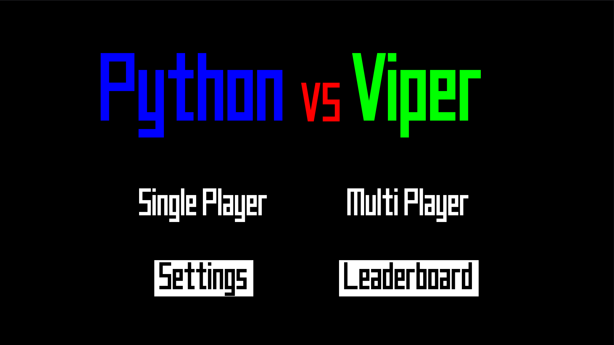
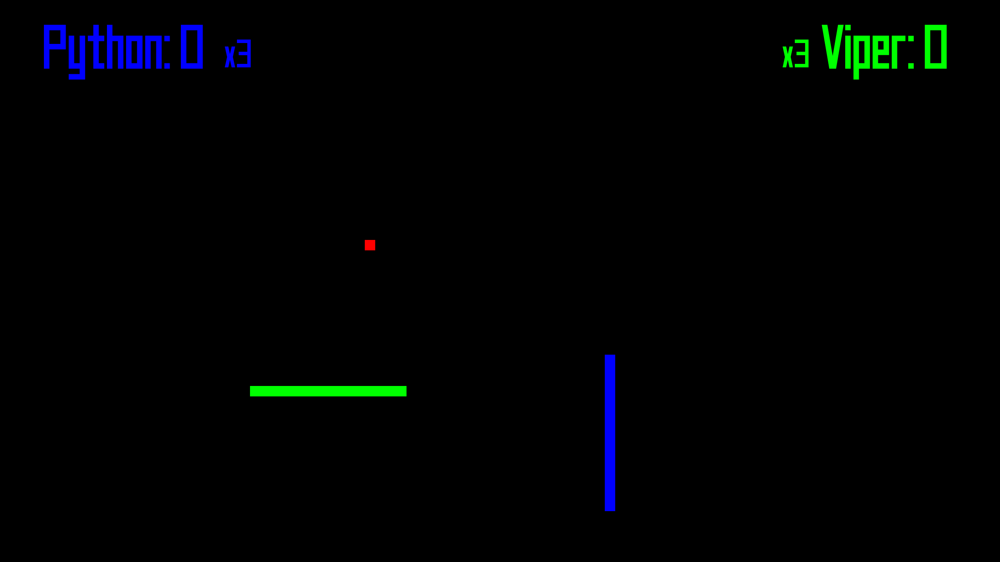
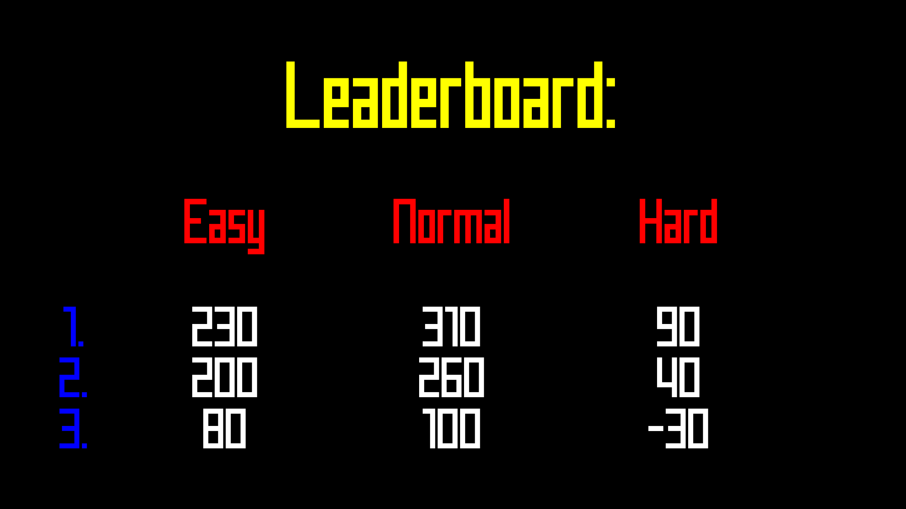

# Python VS Viper ![Python][python] ![Release][release] ![License][license]

> A revamped version of the classic Snake.

Python VS Viper is a very simple project created to learn Python.

Check out also the [**Android**](https://github.com/filipposerafini/PythonVsAndroid) version.

## Requirements

The game requires [**python**](https://www.python.org/getit/) and [**pygame**](https://github.com/pygame/pygame).

## Usage

To play clone this repository
```
git clone https://github.com/filipposerafini/PythonVsViper`
```

and run `python main.py`.

## Screenshots







## Thanks

Special thanks to **Alessandro Berionni**, the author of the songs present in the game.

## License

Distributed under the [MIT](LICENSE) license.

Copyright &copy; 2018, [Filippo Serafini](https://filipposerafini.github.io/)

[python]: https://img.shields.io/badge/python-2.7/3-blue.svg?longCache=true&style=flat-square
[release]: https://img.shields.io/badge/Release-1.2-brightgreen.svg?longCache=true&style=flat-square
[license]: https://img.shields.io/badge/License-MIT-red.svg?longCache=true&style=flat-square
